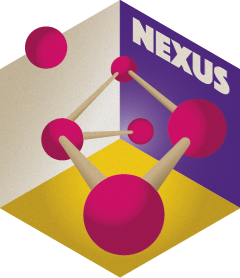

<!-- README.md is generated from README.Rmd. Please edit that file -->

```{r, include = FALSE}
knitr::opts_chunk$set(
  collapse = TRUE,
  comment = "#>",
  fig.path = "man/figures/README-",
  out.width = NULL
)
Sys.setenv(LANGUAGE = "en") # Force locale
```

# nexus 

<!-- badges: start -->
[](https://packages.tesselle.org/nexus/coverage/)
[](https://cran.r-project.org/package=nexus)

[](https://tesselle.r-universe.dev/nexus){.pkgdown-devel}
[](https://cran.r-project.org/package=nexus){.pkgdown-release}
[](https://cran.r-project.org/web/checks/check_results_nexus.html){.pkgdown-release}
[](https://cran.r-project.org/package=nexus){.pkgdown-release}

[](https://www.repostatus.org/#wip)

[](https://doi.org/10.5281/zenodo.10225630)
<!-- badges: end -->

## Overview

This package is currently *experimental*. This means that it is functional, but interfaces and functionalities may change over time, testing and documentation may be lacking.

Exploration and analysis of compositional data in the framework of @aitchison1986. **nexus** provides tools for chemical fingerprinting and source tracking of ancient materials. This package provides methods for compositional data analysis:

* Compositional statistics.
* Compositional data visualization.
* Logratio transformations: `transform_lr()`, `transform_clr()`, `transform_alr()`, `transform_ilr()`, `transform_plr()`.
* Zero and missing value replacement.
* Outlier detection: `detect_outlier()`.

This package also includes methods for provenance studies:

* Multivariate analysis: `pca()`.
* Mixed-mode analysis using geochemical and petrographic data [@baxter2008]: `mix()`.

[**isopleuros**](https://packages.tesselle.org/isopleuros/) is a companion package to **nexus** that allows to create ternary plots.

---

```{r citation, echo=FALSE, comment='', results='asis'}
cite <- utils::citation("nexus")
print(cite, bibtex = FALSE)
```

## Installation

You can install the released version of **nexus** from [CRAN](https://CRAN.R-project.org) with:

```{r cran-installation, eval=FALSE}
install.packages("nexus")
```

And the development version from [Codeberg](https://codeberg.org/) with:

```{r gh-installation, eval=FALSE}
# install.packages("remotes")
remotes::install_git("https://codeberg.org/tesselle/nexus")
```

## Usage

```{r packages}
## Install extra packages (if needed)
# install.packages("folio")

## Load the package
library(nexus)
```

**nexus** provides a set of S4 classes that represent different special types of matrix (see `vignette("nexus")`). The most basic class represents a compositional data matrix, i.e. quantitative (nonnegative) descriptions of the parts of some whole, carrying relative, rather than absolute, information [@aitchison1986].

*It assumes that you keep your data tidy*: each variable must be saved in its own column and each observation (sample) must be saved in its own row.
  
```{r groups}
## Data from Wood and Liu 2023
data("bronze", package = "folio")

## Coerce to compositional data
coda <- as_composition(bronze, parts = 4:11)

## Use dynasties as groups
coda <- group(coda, by = bronze$dynasty)
```

```{r barplot, fig.width=5, fig.height=7}
## Select major elements
major <- coda[, is_element_major(coda)]

## Compositional barplot
barplot(major, order_rows = "Cu", names = FALSE, border = NA, space = 0)
```

```{r lra, fig.width=7, fig.height=7, out.width='50%', fig.show='hold'}
## Log-ratio analysis
## (PCA of centered log-ratio; outliers should be removed first)
clr <- transform_clr(coda, weights = TRUE)
lra <- pca(clr)

## Visualize results
viz_individuals(
  x = lra, 
  extra_quali = group_names(clr),
  color = c("#004488", "#DDAA33", "#BB5566"),
  hull = TRUE
)

viz_variables(lra)
```

## Contributing

Please note that the **nexus** project is released with a [Contributor Code of Conduct](https://www.tesselle.org/conduct.html). By contributing to this project, you agree to abide by its terms.

## References

```{r metadata, include=FALSE}
## Update codemeta.json
codemetar::write_codemeta(verbose = FALSE)

## Update CITATION.cff
cff_keys <- list(
  # message = format(citation("nexus")[[1]], style = "text"),
  identifiers = list(
    list(description = "The concept DOI.",
         type = "doi",
         value = "10.5281/zenodo.10225630"),
    list(description = "The versioned DOI for version 0.1.0.",
         type = "doi",
         value = "10.5281/zenodo.10225631"),
    list(description = "The versioned DOI for version 0.2.0.",
         type = "doi",
         value = "10.5281/zenodo.10711236"),
    list(description = "The versioned DOI for version 0.3.0.",
         type = "doi",
         value = "10.5281/zenodo.13646482"),
    list(description = "The versioned DOI for version 0.4.0.",
         type = "doi",
         value = "10.5281/zenodo.14645055"),
    list(description = "The CRAN DOI",
         type = "doi",
         value = "10.32614/cran.package.nexus")
  )
)
cff <- cffr::cff_create("DESCRIPTION", keys = cff_keys)
if (cffr::cff_validate(cff)) cffr::cff_write(cff, outfile = "CITATION.cff")
```
