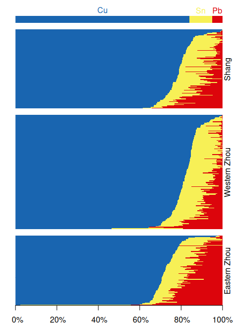
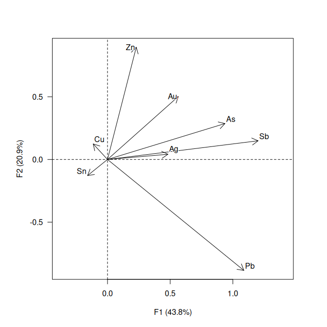

<!-- README.md is generated from README.Rmd. Please edit that file -->

# nexus 

<!-- badges: start -->

[](https://cran.r-project.org/package=nexus)

<a href="https://tesselle.r-universe.dev/nexus"
class="pkgdown-devel"></a>
<a href="https://cran.r-project.org/package=nexus"
class="pkgdown-release"></a>
<a href="https://cran.r-project.org/web/checks/check_results_nexus.html"
class="pkgdown-release"></a>
<a href="https://cran.r-project.org/package=nexus"
class="pkgdown-release"></a>

[](https://www.repostatus.org/#wip)

[](https://doi.org/10.5281/zenodo.10225630)
<!-- badges: end -->

## Overview

This package is currently *experimental*. This means that it is
functional, but interfaces and functionalities may change over time,
testing and documentation may be lacking.

Exploration and analysis of compositional data in the framework of J.
Aitchison (1986). **nexus** provides tools for chemical fingerprinting
and source tracking of ancient materials. This package provides methods
for compositional data analysis:

- Compositional statistics.
- Compositional data visualization.
- Logratio transformations: `transform_lr()`, `transform_clr()`,
  `transform_alr()`, `transform_ilr()`, `transform_plr()`.
- Zero and missing value replacement.
- Outlier detection: `detect_outlier()`.

This package also includes methods for provenance studies:

- Multivariate analysis: `pca()`.
- Mixed-mode analysis using geochemical and petrographic data (Baxter et
  al. 2008): `mix()`.

[**isopleuros**](https://packages.tesselle.org/isopleuros/) is a
companion package to **nexus** that allows to create ternary plots.

------------------------------------------------------------------------

To cite nexus in publications use:

Frerebeau N, Philippe A (2025). *nexus: Sourcing Archaeological
Materials by Chemical Composition*. Université Bordeaux Montaigne,
Pessac, France. <doi:10.5281/zenodo.10225630>
<https://doi.org/10.5281/zenodo.10225630>, R package version 0.4.0,
<https://packages.tesselle.org/nexus/>.

This package is a part of the tesselle project
<https://www.tesselle.org>.

## Installation

You can install the released version of **nexus** from
[CRAN](https://CRAN.R-project.org) with:

``` r
install.packages("nexus")
```

And the development version from [Codeberg](https://codeberg.org/) with:

``` r
# install.packages("remotes")
remotes::install_git("https://codeberg.org/tesselle/nexus")
```

## Usage

``` r
## Install extra packages (if needed)
# install.packages("folio")

## Load the package
library(nexus)
#> Loading required package: dimensio
```

**nexus** provides a set of S4 classes that represent different special
types of matrix (see `vignette("nexus")`). The most basic class
represents a compositional data matrix, i.e. quantitative (nonnegative)
descriptions of the parts of some whole, carrying relative, rather than
absolute, information (J. Aitchison 1986).

*It assumes that you keep your data tidy*: each variable must be saved
in its own column and each observation (sample) must be saved in its own
row.

``` r
## Data from Wood and Liu 2023
data("bronze", package = "folio")

## Coerce to compositional data
coda <- as_composition(bronze, parts = 4:11)

## Use dynasties as groups
coda <- group(coda, by = bronze$dynasty)
```

``` r
## Select major elements
major <- coda[, is_element_major(coda)]

## Compositional barplot
barplot(major, order_rows = "Cu", names = FALSE, border = NA, space = 0)
```

<!-- -->

``` r
## Log-ratio analysis
## (PCA of centered log-ratio; outliers should be removed first)
clr <- transform_clr(coda, weights = TRUE)
lra <- pca(clr)

## Visualize results
viz_individuals(
  x = lra, 
  extra_quali = group_names(clr),
  color = c("#004488", "#DDAA33", "#BB5566"),
  hull = TRUE
)

viz_variables(lra)
```



## Contributing

Please note that the **nexus** project is released with a [Contributor
Code of Conduct](https://www.tesselle.org/conduct.html). By contributing
to this project, you agree to abide by its terms.

## References

<div id="refs" class="references csl-bib-body hanging-indent"
entry-spacing="0">

<div id="ref-aitchison1986" class="csl-entry">

Aitchison, J. 1986. *The Statistical Analysis of Compositional Data*.
Monographs on Statistics and Applied Probability. Londres, UK ; New
York, USA: Chapman and Hall.

</div>

<div id="ref-aitchison1997" class="csl-entry">

———. 1997. “The One-Hour Course in Compositional Data Analysis or
Compositional Data Analysis Is Simple.” In *IAMG’97*, edited by V.
Pawlowsky-Glahn, 3–35. Barcelona: International Center for Numerical
Methods in Engineering (CIMNE).

</div>

<div id="ref-aitchison2002" class="csl-entry">

Aitchison, John, and Michael Greenacre. 2002. “Biplots of Compositional
Data.” *Journal of the Royal Statistical Society: Series C (Applied
Statistics)* 51 (4): 375–92. <https://doi.org/10.1111/1467-9876.00275>.

</div>

<div id="ref-baxter2008" class="csl-entry">

Baxter, M. J., C. C. Beardah, I. Papageorgiou, M. A. Cau, P. M. Day, and
V. Kilikoglou. 2008. “On Statistical Approaches to the Study of Ceramic
Artefacts Using Geochemical and Petrographic Data.” *Archaeometry* 50
(1): 142–57. <https://doi.org/10.1111/j.1475-4754.2007.00359.x>.

</div>

<div id="ref-beardah2003" class="csl-entry">

Beardah, C. C., M. J. Baxter, I. Papageorgiou, and M. A. Cau. 2003.
“"<span class="nocase">Mixed-mode</span>" Approaches to the Grouping of
Ceramic Artefacts Using S-Plus.” In *The Digital Heritage of
Archaeology.*, edited by M. Doerr and A. Sarris, 261–66. Athens: Archive
of Monuments and Publications, Hellenic Ministry of Culture.

</div>

<div id="ref-vandenboogaart2013" class="csl-entry">

Boogaart, K. Gerald van den, and Raimon Tolosana-Delgado. 2013.
*Analyzing Compositional Data with R*. Use R! Berlin Heidelberg:
Springer-Verlag. <https://doi.org/10.1007/978-3-642-36809-7>.

</div>

<div id="ref-cau2004" class="csl-entry">

Cau, Miguel-Angel, Peter M Day, Michael J Baxter, Ioulia Papageorgiou,
Ioannis Iliopoulos, and Giuseppe Montana. 2004. “Exploring Automatic
Grouping Procedures in Ceramic Petrology.” *Journal of Archaeological
Science* 31 (9): 1325–38. <https://doi.org/10.1016/j.jas.2004.03.006>.

</div>

<div id="ref-egozcue2003" class="csl-entry">

Egozcue, J. J., V. Pawlowsky-Glahn, G. Mateu-Figueras, and C.
Barceló-Vidal. 2003. “Isometric Logratio Transformations for
Compositional Data Analysis.” *Mathematical Geology* 35 (3): 279–300.
<https://doi.org/10.1023/A:1023818214614>.

</div>

<div id="ref-egozcue2024" class="csl-entry">

Egozcue, Juan José, Caterina Gozzi, Antonella Buccianti, and Vera
Pawlowsky-Glahn. 2024. “Exploring Geochemical Data Using Compositional
Techniques: A Practical Guide.” *Journal of Geochemical Exploration* 258
(March): 107385. <https://doi.org/10.1016/j.gexplo.2024.107385>.

</div>

<div id="ref-egozcue2023" class="csl-entry">

Egozcue, Juan José, and Vera Pawlowsky-Glahn. 2023. “Subcompositional
Coherence and and a Novel Proportionality Index of Parts.” *SORT* 47
(2): 229–44. <https://doi.org/10.57645/20.8080.02.7>.

</div>

<div id="ref-filzmoser2005" class="csl-entry">

Filzmoser, Peter, Robert G. Garrett, and Clemens Reimann. 2005.
“Multivariate Outlier Detection in Exploration Geochemistry.” *Computers
& Geosciences* 31 (5): 579–87.
<https://doi.org/10.1016/j.cageo.2004.11.013>.

</div>

<div id="ref-filzmoser2008" class="csl-entry">

Filzmoser, Peter, and Karel Hron. 2008. “Outlier Detection for
Compositional Data Using Robust Methods.” *Mathematical Geosciences* 40
(3): 233–48. <https://doi.org/10.1007/s11004-007-9141-5>.

</div>

<div id="ref-filzmoser2009" class="csl-entry">

Filzmoser, Peter, Karel Hron, and Clemens Reimann. 2009a. “Principal
Component Analysis for Compositional Data with Outliers.”
*Environmetrics* 20 (6): 621–32. <https://doi.org/10.1002/env.966>.

</div>

<div id="ref-filzmoser2009a" class="csl-entry">

———. 2009b. “Univariate Statistical Analysis of Environmental
(Compositional) Data: Problems and Possibilities.” *Science of The Total
Environment* 407 (23): 6100–6108.
<https://doi.org/10.1016/j.scitotenv.2009.08.008>.

</div>

<div id="ref-filzmoser2010" class="csl-entry">

———. 2010. “The Bivariate Statistical Analysis of Environmental
(Compositional) Data.” *Science of The Total Environment* 408 (19):
4230–38. <https://doi.org/10.1016/j.scitotenv.2010.05.011>.

</div>

<div id="ref-filzmoser2012" class="csl-entry">

———. 2012. “Interpretation of Multivariate Outliers for Compositional
Data.” *Computers & Geosciences* 39: 77–85.
<https://doi.org/10.1016/j.cageo.2011.06.014>.

</div>

<div id="ref-filzmoser2018" class="csl-entry">

Filzmoser, Peter, Karel Hron, and Matthias Templ. 2018. *Applied
Compositional Data Analysis: With Worked Examples in R*. Use R! Berlin
Heidelberg: Springer-Verlag.
<https://doi.org/10.1007/978-3-319-96422-5>.

</div>

<div id="ref-fiserova2011" class="csl-entry">

Fišerová, Eva, and Karel Hron. 2011. “On the Interpretation of
Orthonormal Coordinates for Compositional Data.” *Mathematical
Geosciences* 43 (4): 455–68.
<https://doi.org/10.1007/s11004-011-9333-x>.

</div>

<div id="ref-greenacre2021" class="csl-entry">

Greenacre, Michael. 2021. “Compositional Data Analysis.” *Annual Review
of Statistics and Its Application* 8 (1): 271–99.
<https://doi.org/10.1146/annurev-statistics-042720-124436>.

</div>

<div id="ref-greenacre2019" class="csl-entry">

Greenacre, Michael J. 2019. *Compositional Data Analysis in Practice*.
Chapman & Hall/CRC Interdisciplinary Statistics. Boca Raton: CRC Press,
Taylor & Francis Group.

</div>

<div id="ref-greenacre2024" class="csl-entry">

Greenacre, Michael, and Jonathan R. Wood. 2024. “A Comprehensive
Workflow for Compositional Data Analysis in Archaeometry, with Code in
R.” *Archaeological and Anthropological Sciences* 16 (10): 171.
<https://doi.org/10.1007/s12520-024-02070-w>.

</div>

<div id="ref-grunsky2024" class="csl-entry">

Grunsky, Eric, Michael Greenacre, and Bruce Kjarsgaard. 2024. “GeoCoDA:
Recognizing and Validating Structural Processes in Geochemical Data. A
Workflow on Compositional Data Analysis in Lithogeochemistry.” *Applied
Computing and Geosciences* 22 (June): 100149.
<https://doi.org/10.1016/j.acags.2023.100149>.

</div>

<div id="ref-hron2017" class="csl-entry">

Hron, Karel, Peter Filzmoser, Patrice de Caritat, Eva Fišerová, and
Alžběta Gardlo. 2017. “Weighted Pivot Coordinates for Compositional Data
and Their Application to Geochemical Mapping.” *Mathematical
Geosciences* 49 (6): 797–814.
<https://doi.org/10.1007/s11004-017-9684-z>.

</div>

<div id="ref-hron2011" class="csl-entry">

Hron, Karel, and Lubomír Kubáček. 2011. “Statistical Properties of the
Total Variation Estimator for Compositional Data.” *Metrika* 74 (2):
221–30. <https://doi.org/10.1007/s00184-010-0299-3>.

</div>

<div id="ref-hron2010" class="csl-entry">

Hron, K., M. Templ, and P. Filzmoser. 2010. “Imputation of Missing
Values for Compositional Data Using Classical and Robust Methods.”
*Computational Statistics & Data Analysis* 54 (12): 3095–3107.
<https://doi.org/10.1016/j.csda.2009.11.023>.

</div>

<div id="ref-martin-fernandez2003" class="csl-entry">

Martín-Fernández, J. A., C. Barceló-Vidal, and V. Pawlowsky-Glahn. 2003.
“Dealing with Zeros and Missing Values in Compositional Data Sets Using
Nonparametric Imputation.” *Mathematical Geology* 35 (3): 253–78.
<https://doi.org/10.1023/A:1023866030544>.

</div>

<div id="ref-pawlowsky-glahn2001" class="csl-entry">

Pawlowsky-Glahn, V., and J. J. Egozcue. 2001. “Geometric Approach to
Statistical Analysis on the Simplex.” *Stochastic Environmental Research
and Risk Assessment* 15 (5): 384–98.
<https://doi.org/10.1007/s004770100077>.

</div>

<div id="ref-rousseeuw1990" class="csl-entry">

Rousseeuw, Peter J., and Bert C. van Zomeren. 1990. “Unmasking
Multivariate Outliers and Leverage Points.” *Journal of the American
Statistical Association* 85 (411): 633–39.
<https://doi.org/10.1080/01621459.1990.10474920>.

</div>

<div id="ref-santos2020" class="csl-entry">

Santos, Frédéric. 2020. “Modern Methods for Old Data: An Overview of
Some Robust Methods for Outliers Detection with Applications in
Osteology.” *Journal of Archaeological Science: Reports* 32: 102423.
<https://doi.org/10.1016/j.jasrep.2020.102423>.

</div>

<div id="ref-weigand1977" class="csl-entry">

Weigand, P. C., G. Harbottle, and E. Sayre. 1977. “Turquoise Sources and
Source Analysisis: Mesoamerica and the Southwestern U.S.A.” In *Exchange
Systems in Prehistory*, edited by J. Ericson and T. K. Earle, 15–34. New
York, NY: Academic Press.

</div>

</div>
